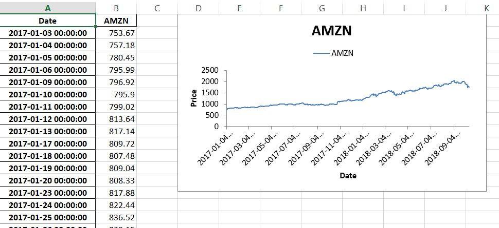

# UrlMonitor
Well ... not ready ... aws monitor URL

# Panda in Python to pull stock ticker from Yahoo Finance


```
###########################################################################################
#
# Pull yahoo ticker history data using Panda_DataReader
#
# NOTE: Old way of Panda.io.data no longer works
#
# Examples tickers: FITB, AAPL, AMZN
#
# ToDo:
#  <1> Add command line option ("-f") to allow user to import text file with stock tickers
#  <2> Create separate excell file for each worksheet
#
###########################################################################################

import pandas as pd
#import pandas.io.data as web
from pandas_datareader import data as web

ticker = 'AMZN'
data = web.get_data_yahoo('AMZN', '1/1/2017', '10/15/2018')
df = pd.DataFrame({'AMZN': data['Adj Close']})

excel_file = 'AMZN.xlsx'
sheet_name =  'Sheet1'

writer = pd.ExcelWriter(excel_file, engine = 'xlsxwriter')
df.to_excel(writer, sheet_name = sheet_name)
 
workbook = writer.book
worksheet = writer.sheets[sheet_name]
worksheet.set_column('A:A', 20)
 
chart = workbook.add_chart({'type': 'line'})
max_row = len(df) + 1
chart.add_series({
		'name':       ['Sheet1', 0, 1],
			'categories': ['Sheet1', 2, 0, max_row, 0],
				'values':     ['Sheet1', 2, 1, max_row, 1],
					'line':       {'width': 1.00},
					})
 
chart.set_x_axis({'name': 'Date', 'date_axis': True})
chart.set_y_axis({'name': 'Price', 'major_gridlines': {'visible': False}})
chart.set_legend({'position': 'top'})
 
worksheet.insert_chart('D1', chart)
writer.save()

print excel_file + " file is created"

```
